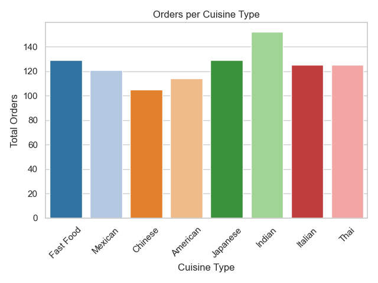
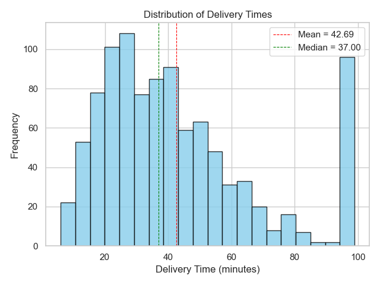
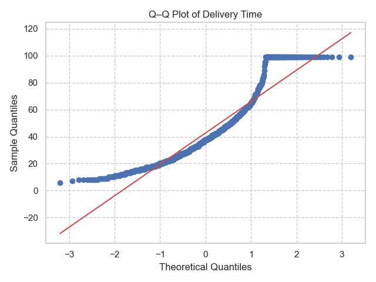
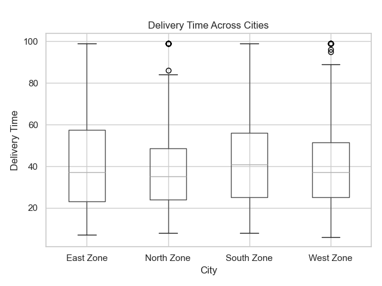
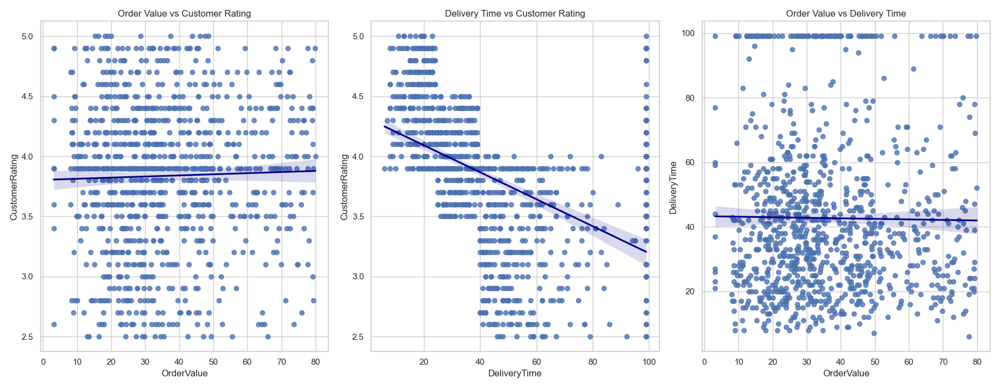
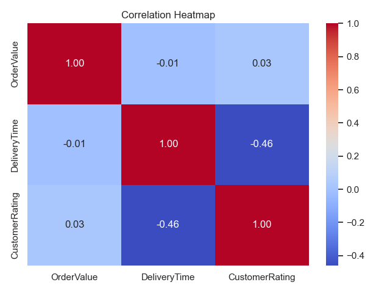
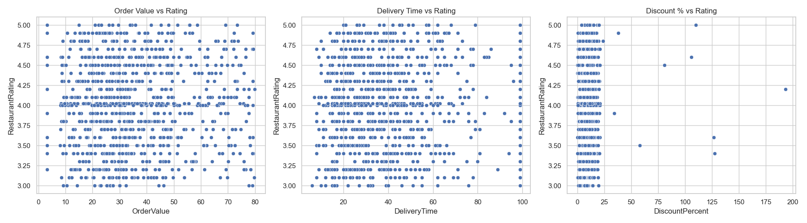
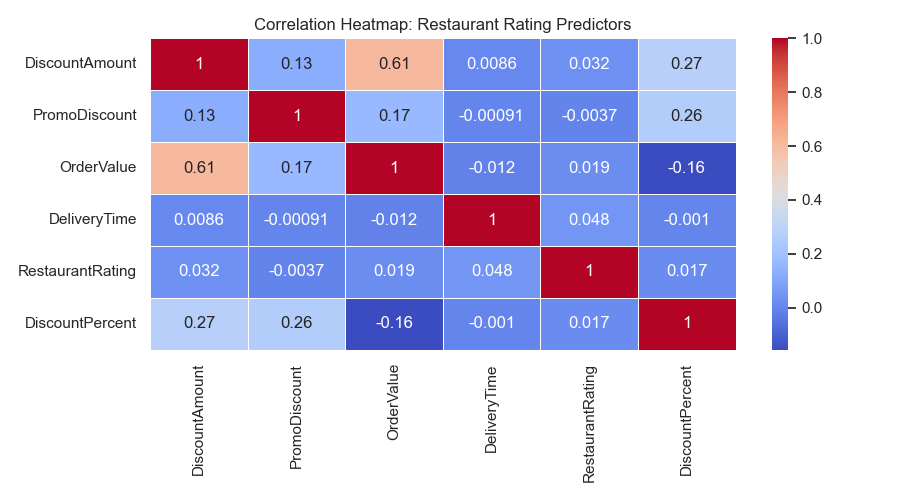

# 🍔 FoodExpress — Platform Statistical Report
### Comprehensive Data Analysis & Insights
**Prepared by:** Sakib Ahmed

---

## 📊 Platform Overview

| Metric | Value |
|---|---|
| 🍽️ Cuisine Types | 8 |
| ⏱️ Avg Delivery Time | 42.7 min |
| 👑 VIP Customer Share | 52.7% |
| 💰 Net Revenue | 26,961 |

---

## 1. Executive Summary

This report presents a comprehensive statistical analysis of FoodExpress delivery operations over one month, evaluating delivery performance, customer satisfaction drivers, cuisine-level behavior, and promotional effectiveness across multiple city zones.

**Key findings:** Delivery speed is the primary driver of customer satisfaction (r = −0.46), while discounts and order value have minimal impact on ratings. VIP customers comprise the majority of the user base but rate similarly to regular customers, suggesting current tiering benefits need improvement.

### Tools & Libraries Used

| Tool | Purpose |
|---|---|
| Python | Core programming language |
| Jupyter Notebook | Analysis workflow documentation |
| Pandas | Data cleaning & transformation |
| NumPy | Numerical calculations |
| Matplotlib | Charts & visualizations |
| Seaborn | Correlation heatmaps |
| SciPy | Hypothesis testing (t-tests, ANOVA) |
| Microsoft Excel | Initial data review |
| Microsoft PowerPoint | Presentation & reporting |

---

## 2. Cuisine Performance Analysis

### 2.1 Orders per Cuisine Type

Indian cuisine leads with the highest order volume (~150 orders), followed closely by Japanese and Fast Food. American and Chinese cuisines record the lowest volumes, indicating potential gaps in demand or visibility. Italian cuisine delivers the highest average order value, while American cuisine records the lowest, suggesting possible over-discounting or reduced basket sizes.

**Business Impact:** Upselling strategies for American and Indian cuisines could increase average order value by **10–15%**. Launching premium family packages for Italian cuisine and youth-focused campaigns for Fast Food and Chinese categories can drive stronger repeat purchase rates.

---

## 3. Delivery Time Performance

### 3.1 Distribution of Delivery Times

The delivery time distribution is right-skewed with a **mean of 42.69 min** and **median of 37.00 min**, indicating that a small number of very delayed orders pull the average upward. A notable spike at the 90–100 minute range reveals operational bottlenecks during peak hours or delays from specific restaurant partners.

**Business Impact:** Optimizing peak-hour logistics and restaurant coordination may reduce average delivery time by **10–20%**, directly improving customer satisfaction and repeat order rates.

---

### 3.2 Normality Check — Q-Q Plot of Delivery Time

The Q-Q plot reveals a clear deviation from the normal distribution line, with heavy clustering at the lower end and a sharp jump near the upper quantiles. This confirms the delivery time data is **non-normally distributed** with right skew and ceiling effects near 100 minutes, validating the use of non-parametric tests for further analysis.

---

### 3.3 One-Sample T-Test — North Zone Delivery Time

Delivery times in the North Zone are heavily concentrated between **30–40 minutes**, though a secondary peak around 100 minutes reveals a subset of severely delayed orders. The bimodal KDE shape indicates two distinct delivery behavior clusters — efficient deliveries and significantly delayed ones — suggesting inconsistent routing or restaurant preparation times.

**Business Impact:** Splitting the North Zone into smaller delivery clusters and adding peak-hour riders could reduce average delivery time and improve on-time performance by **8–12%**.

---

### 3.4 One-Way ANOVA — Delivery Time Across City Zones

Delivery times are broadly similar across all four zones, with medians falling between **35–45 minutes**. However, the West Zone shows the most outliers (up to 100 min), while the North Zone has a tighter IQR, suggesting more predictable — but still elevated — delivery times. East and South zones show the widest variability overall.

**Business Impact:** Increasing delivery fleet allocation in West and North Zones and prioritizing VIP customer routing can reduce variability and strengthen platform reliability across all regions.

---

## 4. Customer Segment Analysis

### 4.1 Customer Segment Breakdown

| Segment | Share |
|---|---|
| 👑 VIP Customer | 52.7% |
| 🟢 Regular Customer | 29.2% |
| 🔵 New Customer | 18.2% |

VIP customers drive the majority of demand at **52.7%**, making them the critical retention focus. Regular customers at 29.2% represent the strongest upgrade opportunity, while new customers at 18.2% indicate healthy acquisition with room for stronger first-time conversion strategies.

**Business Impact:** Converting a portion of Regular users to VIP can raise customer lifetime value by **5–8%**. Strengthening acquisition campaigns for New customers may expand total order volume by **4–6%**.

---

### 4.2 T-Test — VIP vs. Regular Customer Ratings

Both VIP and Regular customers show nearly identical rating distributions, with medians around **3.9** and similar IQRs (3.5–4.3). The independent samples t-test result (p > 0.05) confirms no statistically significant difference, indicating the current VIP membership is not delivering a meaningfully better experience.

**Business Impact:** Introducing stronger VIP-exclusive benefits — priority dispatch, exclusive deals, dedicated support — could improve VIP retention by **5–8%** and create a measurable satisfaction gap.

---

## 5. Correlation & Ratings Analysis

### 5.1 Order Value, Delivery Time & Customer Ratings

The scatter plots reveal a clear downward trend between Delivery Time and Customer Rating, while Order Value shows no directional pattern against ratings. The Discount % vs. Rating plot shows extremely sparse, irregular distribution with no linear relationship, confirming that financial incentives do not drive satisfaction.

---

### 5.2 Correlation Heatmap — Core Variables

| Variable Pair | Correlation | Finding |
|---|---|---|
| Order Value vs Customer Rating | r = 0.03 | No meaningful relationship |
| **Delivery Time vs Customer Rating** | **r = −0.46** | **Strong negative correlation** |
| Order Value vs Delivery Time | r = −0.01 | Weak / no relationship |

**Delivery time is the single strongest predictor of customer satisfaction.** Order value and discounts show negligible influence, confirming that operational efficiency — not spending or promotions — is the core driver of retention.

**Business Impact:** Faster delivery through route optimization can improve satisfaction scores and increase repeat orders by **8–12%**.

---

### 5.3 Multiple Correlation — Restaurant Rating Predictors

Restaurant Rating shows near-zero correlation with all financial and operational variables — the highest being Delivery Time at just **0.048**. The strongest relationship in the entire heatmap is between DiscountAmount and OrderValue (r = 0.61), confirming these two are structurally linked but neither drives restaurant-level satisfaction.

**Business Impact:** Since ratings are driven by food quality and service — not discounts — shifting budget toward quality audits and packaging improvements can lower complaint rates by **4–7%**.

---

### 5.4 Correlation Analysis — Restaurant Rating Scatter

The scatter plots confirm that Order Value, Delivery Time, and Discount % all show diffuse, uncorrelated distributions against Restaurant Rating. There is no concentration of higher ratings at any particular price point or delivery speed, reinforcing that **intrinsic food and service quality** are the dominant rating factors.

---

## 6. Temporal Performance Analysis

### 6.1 Weekend vs. Weekday Delivery Performance

A paired t-test (p < 0.05) confirmed that **weekday delivery times are consistently longer than weekends**, driven by lunch and dinner rush congestion. Moderate variability (SE = 2.45) suggests delays cluster around specific high-latency restaurant groups rather than being uniformly distributed.

**Business Impact:** Optimizing rider allocation during weekday peak hours can reduce average delivery time by **8–12%**. Early-order incentives can shift demand away from peak windows, reducing operational strain by **4–6%**.

---

### 6.2 Before & After Promotional Campaign

A paired t-test comparing Week 1 (pre-campaign) vs. Week 3 (post-campaign) order values showed a **statistically significant increase (p < 0.05)** in customer spending. Week 3 outperformed Week 1 in mean basket size, confirming the promotion directly and effectively influenced purchase behavior across participating restaurant partners.

**Business Impact:** Repeating this campaign model monthly can increase average revenue per order by **8–12%**. Targeting low-frequency customers with recurring offers can increase repeat purchase rates by **5–7%**.

---

## 7. Strategic Recommendations

| Recommendation | Priority | Timeline | Expected Impact |
|---|---|---|---|
| Optimize delivery routing in North & West zones | 🔴 High | Short-term | Reduce avg delivery time, improve ratings |
| Increase peak-hour rider allocation (lunch & dinner) | 🔴 High | Short-term | Lower delayed deliveries, improve on-time rate |
| Redesign VIP benefits (priority dispatch, exclusive offers) | 🔴 High | Short-term | Improve VIP retention, strengthen loyalty |
| Replicate promotional campaign monthly | 🟡 Medium | Short-term | Increase avg order value & platform revenue |
| Launch targeted upgrade offers for Regular → VIP | 🟡 Medium | Medium-term | Increase customer lifetime value |
| Focus quality audits on low-rated restaurant partners | 🔴 High | Medium-term | Improve restaurant ratings, reduce complaints |
| Introduce cuisine-specific upselling bundles (American, Indian) | 🟡 Medium | Medium-term | Raise average basket size |
| Develop predictive staffing by weekday/time-zone demand | 🔴 High | Long-term | Improve delivery efficiency & cost control |
| Create restaurant performance scorecards for partners | 🟡 Medium | Long-term | Better vendor management, service consistency |
| Shift from blanket discounts to loyalty bundles | 🟡 Medium | Long-term | Improve profitability, maintain repeat orders |

---

## 8. Expected Outcomes

If implemented, FoodExpress may achieve:

- ✅ Faster average delivery times
- ✅ Higher customer satisfaction ratings
- ✅ Improved repeat order rate
- ✅ Stronger VIP retention
- ✅ Increased average order value
- ✅ Better restaurant performance consistency
- ✅ Higher monthly platform revenue

---

## 9. Risk & Limitations

### Key Limitations
- Analysis uses only **one month** of data — long-term trends may not be fully captured
- External factors (traffic, weather, public events) were not included in the model
- Customer ratings are subjective and may not always reflect true service quality
- Statistical tests reveal relationships, not guaranteed cause-and-effect

### Risks
- Seasonal demand patterns may significantly shift results
- VIP-heavy order volume may bias customer-level insights
- Promotional effects may diminish over time
- Zone-level analysis may miss granular local bottlenecks

### Suggested Improvements
- Use **6+ months** of data for trend analysis
- Incorporate traffic and weather variables
- Include restaurant preparation time metrics
- Apply predictive forecasting models

---

## 10. Conclusions

The FoodExpress analysis conclusively shows that **delivery speed is the primary lever for customer satisfaction and retention** (r = −0.46). VIP customers drive the majority of orders but experience no meaningfully better service than regular users, signaling an urgent need to strengthen premium membership benefits. Promotional campaigns proved effective as short-term revenue boosters, and geographic delivery performance gaps highlight the need for smarter routing and staffing in underperforming zones. Prioritizing delivery reliability, enhancing loyalty programs, and expanding targeted promotions represent the highest-impact path to sustainable platform growth.

---

*Report prepared by Sakib Ahmed | FoodExpress Statistical Analysis*
